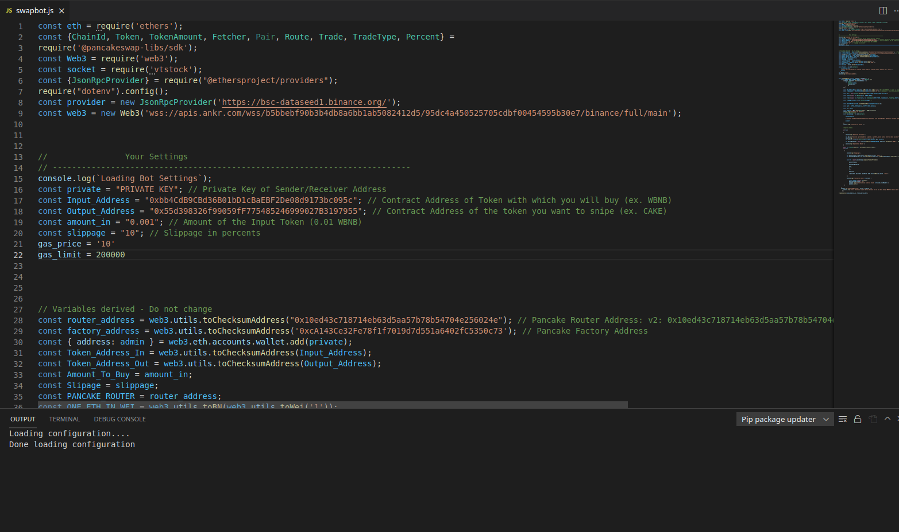

Hey everyone,

I built a basic sniping bot for avax network. Simply put, you fill the settings in swapbot.js and it buys the token for the amount you choose when it hits the swap and liquidity is added.

# What are the features?:

[x] Buy early token gems with custom gas fee, slippage, amount. (DYOR)

[x] Auto approve fees

[x] Open source, with free node services (Literally don't have to pay anything to run this bot)

Working on:

[ ] Sell bought token with custom gas fee, slippage, amount.

[ ] Sell tokens with your custom increase in price, like 50%, 100%, 200%.

[ ] Demo how the code looks

# HOW TO RUN

Download swapbot.js and package.json
Download nodejs for your PC from nodejs org
Open the folder in Visual Studio Code and in the terminal type "npm install"
Set the variables in "Variables" at the top of swapbot.js
Input enough funds for fees and purchases into your wallet
Run with "node swapbot.js" command in the same terminal
Free node included!
Stop bot with Ctrl + C.

Successfull 40,000k snipe the other day :)

